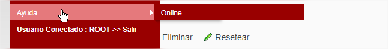

# Menu Sistema

<figure><figcaption>
Menu Sistema
</figcaption></figure>

<figure><figcaption>
Menu Parametrización
</figcaption></figure>

Permite la parametrización de acceso y perfiles del sistema

<figure><figcaption>
Menu Expediente
</figcaption></figure>

Permite&#x20;

<figure><figcaption></figcaption></figure>
